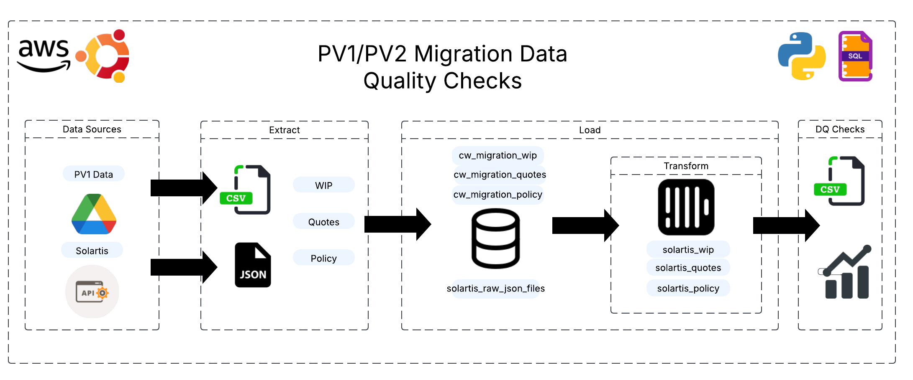

# 🧠 Data Migration DQ Checks

This project implements a complete **ELT + DQ validation pipeline** for verifying data migrations between internal CW systems and Solartis Gateway data.

It processes both **CSV source data** and **JSON migrated data**, performs **structured comparisons**, and generates **visual + Excel-based reports** of mismatches.

---

## 📁 Project Structure

```
data-migration-dq-checks/
├── assets/
│   ├── template_request_files/
│   │   ├── find_policy.json
│   │   ├── find_quote.json
│   │   ├── find_submission.json
│   │   ├── get_documents.json
│   │   ├── get_notes.json
│   │   ├── get_policy.json
│   │   ├── get_quote.json
│   │   └── get_submission.json
│   └── etl_diagram.png
├── dq_checks/
│   ├── dq_table_map.py
│   ├── dq_visuals.py
│   ├── execute.py
│   └── execute_new.py
├── etl/
│   ├── extract/
│   │   ├── extract_drive.py
│   │   ├── extract_drive_old.py
│   │   ├── extract_solartis_api.py
│   │   ├── extract_solartis_api_old.py
│   │   └── generate submission_failure_log.py
│   ├── load/
│   │   ├── csv_load_to_clickhouse.py
│   │   ├── json_load_to_clickhouse.py
│   │   └── tables/
│   │       ├── cw/
│   │       │   ├── Policy/
│   │       │   ├── Quotes/
│   │       │   └── Wip/
│   │       └── solartis/
│   │           ├── Policy/
│   │           ├── Quotes/
│   │           └── Wip/
│   └── transform/
│       ├── models/
│       │   ├── Policy/
│       │   ├── Quotes/
│       │   └── Wip/
│       └── run_transformation_sql.sh
├── resources/
│   └── data-migration-dq-checks.json
├── failed_submissions.txt
├── README.md
├── requirements.txt
├── run_pipeline.sh
└── script.log

```

---

## ⚙️ ELT Overview



### Extract
- `.csv` files = CW source data (Quotes, WIP, Policy)
- `.json` files = Solartis migrated payloads (submission, quote, policy)

### Load
- Custom loaders insert both CSV and JSON into **ClickHouse**
- Each model (e.g. `cw_migration_wip`, `solartis_wip_submissions`) has isolated table structure

### Transform
- SQL transformations normalize nested Solartis JSON (e.g. `submissions.sql`, `vehicles.sql`)
- Creates aggregate versions: `taxes_agg`, `fees_agg`

---

## ✅ Data Quality Checks

### Run a DQ comparison:
```bash
python dq_checks/execute_new.py --model WIP --date 2025-03-15
```

This will:
- Compare each CW table to its Solartis counterpart
- Calculate:
  - Row-level match %
  - Column-level mismatch counts
  - False mismatch (e.g. CW value is null, Solartis is not)
  - Financial field aggregations
- Generate:
  - Excel report with vertical diff breakdowns
  - CSV exports for each tab

---

## 📊 Visual Insights

Once the DQ run is complete, you can generate visualizations from the exported CSVs:

```bash
python dq_checks/dq_visuals.py
```

This will show:
- Column match % by table
- Row vs column match ratio
- Column mismatch heatmaps
- False mismatch bar charts

---

## 📦 Requirements

```bash
pip install -r requirements.txt
```

Key packages:
- `pandas`, `polars`
- `matplotlib`, `seaborn`
- `openpyxl`
- `clickhouse-connect`

---

## 🧼 Git Hygiene

`.gitignore` ensures:
- No `.csv`, `.json`, or `.log` files are committed
- All DQ outputs and test results stay local

---

## 🛠️ Future Enhancements

- Slack/email alerts on critical mismatches
- Streamlit dashboard integration
- Auto-publish visual reports
